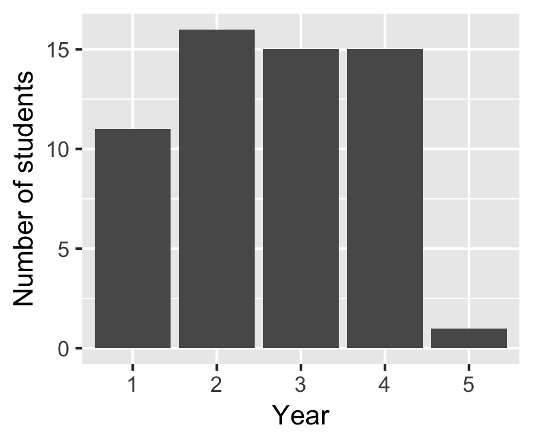
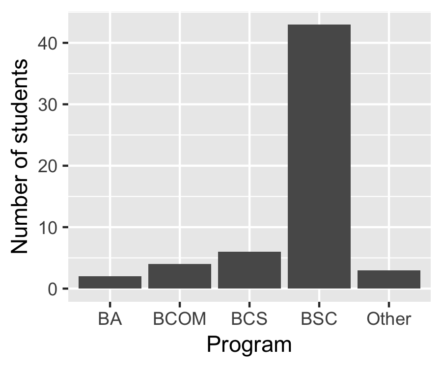
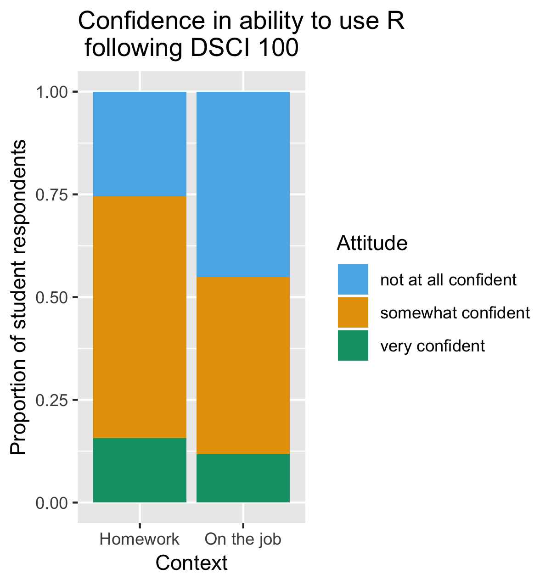
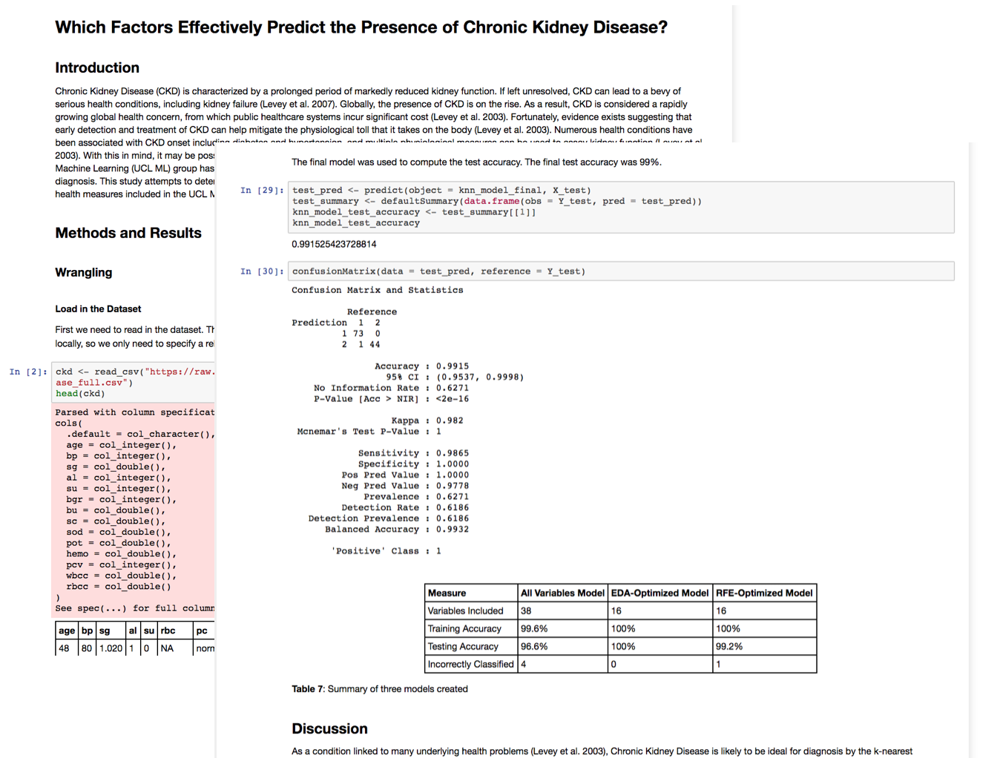
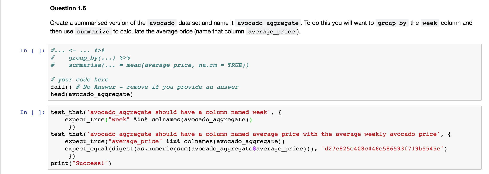
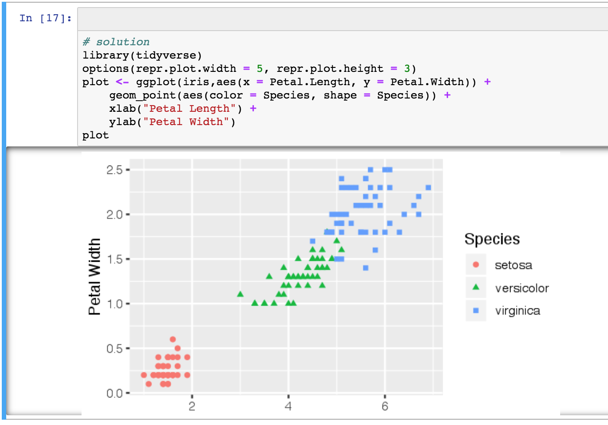
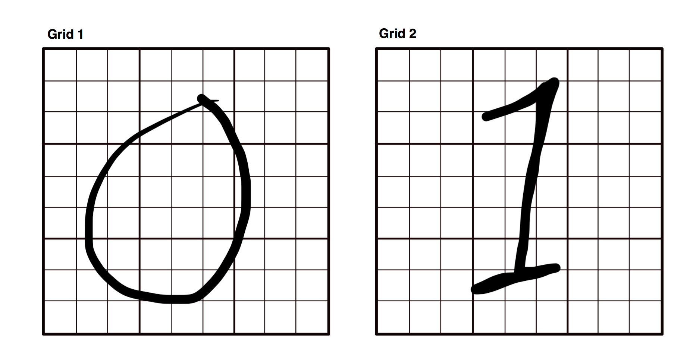
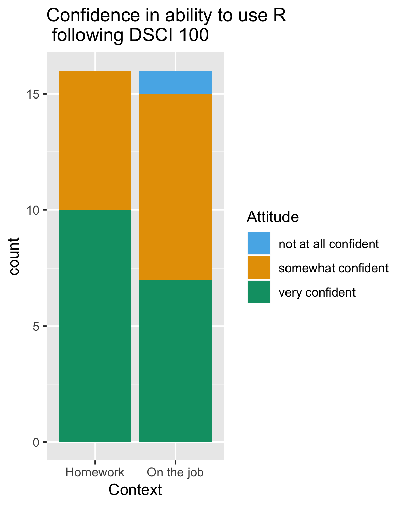

class: middle

# DSCI 100 - Introduction to Data Science

*Use of data science tools to summarize, visualize, and analyze data. Sensible workflows and clear interpretations are emphasized*

Links:
- [UBC course calendar](https://courses.students.ubc.ca/cs/courseschedule?pname=subjarea&tname=subj-course&dept=DSCI&course=100)
- [Course repository on GitHub](https://github.com/UBC-DSCI/dsci-100)
---

# Design Intent

---
class: middle

# Design Intent

1. Introduce Data Science to undergraduates in an authentic way

2. Use pedagogical best practices

3. Reduce barriers to entry and success

---

# Learner Personas 
*intended audience*

prerequisite: MATH 12

--

*Emily is a first year undergraduate who is thinking of becoming a data analyst after she graduates. She only has grade 12 Math. She has heard of the R programming language and knows it is used at her university in many statistics courses (which she plans to take) but never used it (or any other programming language) before. She is finding university very financially challenging and can only afford a Chrome book.*

--

*Mohammed is fourth year Biology undergraduate who plans to attend graduate school next year. His undergraduate honours thesis project requires analysis of data sets that are too big to be opened in JMP, the only data analysis software he has ever used. His thesis supervisor suggested he learn R to do the analysis. The supervisor gave him a book to read to do this, but Mohammed is having a hard time staying motivated doing this on his own without any feedback.*

---

# Our actual learners

.pull-left[

]

.pull-right[

]

---

# High-level learning goals of this course

At the end of the course, students will know how to:

--

- Use modern reproducible tools (Jupyter notebooks, R, `tidyverse` & `caret` R packages) to do data analysis

--

- Recognize when a data science problem can be solved by classification, regression\* or clustering (_ \* in a predictive context only_)

--

- Use R to solve classification, regression and clustering problems, and correctly interpret and communicate the results

---

class: middle

# Course organization and mechanics

.pull-left[

- Two 90 min meetings a week (lecture + tutorial)

- 3/4 flipped classroom

- paperless course

- ~ 60% of assessments were autograded

]

.pull-right[
| Deliverable | % grade |
|------------|----------|
| Lecture worksheets | 5 |
| Tutorial problem sets | 15 |
| Group project | 20 |
| Two quizzes/exams | 20 |
| Final exam | 40 |
]

---
class: inverse, middle

# Introduce Data Science to undergraduates in an authentic way
- Practice what you preach (e.g., teaching materials & tools)
- Give students many opportunities to learn and practice Data Science tools and workflows

---

# Textbook/readings

No modern yet accessible textbooks available that are suitable for our target learners... at least that I am aware of...

--

... so we wrote our own using the `bookdown` R package!

.pull-left[

]

.pull-right[

**An Introduction to Data Science**

by Tiffany Timbers, Melissa Lee & Samuel Hinshaw

https://ubc-dsci.github.io/introduction-to-datascience/
]

- still a work in progress (planned edits/updates happening this summer)
- [open source](https://github.com/UBC-DSCI/introduction-to-datascience) and licensed [CC BY 2.5 CA](https://creativecommons.org/licenses/by/2.5/ca/)

---

# Lecture worksheets & tutorial homework

.pull-left[

]

.pull-right[
- Jupyter notebooks are literate code documents similar to R Markdown

- Markdown and LaTeX rendering in developing environment makes them easier to read while editing

- notebooks can be manually or autograded using an open source tool, [nbgrader](https://nbgrader.readthedocs.io/en/stable/)

]

Examples of DSCI 100 worksheets: 
- [worksheet_01](https://github.com/UBC-DSCI/dsci-100/blob/master/materials/worksheet_01/worksheet_01.ipynb)
- [worksheet_08](https://github.com/UBC-DSCI/dsci-100/blob/master/materials/worksheet_08/worksheet_08.ipynb)

---

# Group project

End product is a self-contained reproducible data analysis and report inside a Jupyter notebook

---

class: inverse, middle

# Use pedagogical best practices

- Case studies
- Practice with immediate feedback
- Active learning activities

---

# Case studies

Each topic was taught within the context of Data Science case studies:

*source: [R for Data Science](https://r4ds.had.co.nz/) by Garrett Grolemund & Hadley Wickham*
---

# Practice with immediate feedback

- autograding via nbgrader has the added advantage that students can run the test to assess if their answer is correct

--

- *they also get to learn about tests as a side-affect*

--

- we used 3 types of exercises:
    - multiple choice questions
    - code & run with fill in the blanks
    - classic code & run

---
class: middle
## Code and run examples

---
class: middle
## Code and run examples

---
class:middle
# Active learning activites

Most lectures and some tutorials had in-class activities, examples include:

- pair/group programming challenges

- tactile exercises

- dance/role-playing

---

## Example pair/group programming challenge

**Instructions to students:** Can petal length and width be used to separate the Iris flower species? Create an effective plot to answer this question! When you are done, share your code on the class forum.

**Then bring everyone together to discuss a solution from the class forum:**

---

## Example pair/group programming challenge

The screens in the DSCI 100 classroom greatly facilitated these activites:

---

## Example tactile exercise

At the beginning of a tutorial on classification of the handwritten digits data set it is very hard for students to understand how you go from images like those shown below to tabular data for k-nn classification.

---

## Example tactile exercise

**Materials:** scissors, tape & printed images (above)

**Exercise:** For each grid:
- give each square an estimated value for pixel intensity (0 for completely white, 1 for completely black)
- use the scissors to cut the printed images into rows
- with tape, paste the rows together to get a single row  

---

## Example of dance/role-playing

To reinforce the algorithm behind Kmeans clustering:

**Set-up:**
- TA's wear coloured t-shirts & students have a post it of each colour
- one post-it note for each student has an asterisk (random)

**Exercise:**
1. students hold up post-it with asterisk 
2. TA's move the center of the students holding up the colour corresponding to their shirt
3. students look for the closest TA and update the colour of the post-it they are holding to match
4. iterate over 2 & 3 until things stop changing
---

class: inverse, middle

# Reducing barriers to entry and success

- Gender and cultural minorities are under represented in STEM

- Aim: remove as many barriers as possible for entry & success in DSCI 100

---

class: middle
## How? 

- Minimal pre-requisites (MATH 12)

- Anonymous class discussion forum (Piazza)

- Formal and public course code of conduct

- **Web server to provide access to homework via the course learning management system (LMS)!**

---
class: middle

## A JupyterHub server accessed via the course LMS

- Did not want to relying on computer labs and/or managing student installation of course software

- Students access homework and necessary software via a button inside course LMS (e.g., Canvas, EdX)

---
class: center, middle

# [Demonstration time!](https://canvas.ubc.ca/courses/19078)

---
class: middle
## Experiment with JupyterHub yourself!

The below links let you access the homework for DSCI 100 via a JupyterHub server that uses Google authentication (and therefore open to everyone):

- [worksheet_01](https://cybera.syzygy.ca/jupyter/hub/user-redirect/git-pull?repo=https%3A%2F%2Fgithub.com%2FUBC-DSCI%2Fdsci-100&branch=master&urlpath=tree%2Fdsci-100%2Fmaterials%2Fworksheet_01%2Fworksheet_01.ipynb)
- [worksheet_08](https://cybera.syzygy.ca/jupyter/hub/user-redirect/git-pull?repo=https%3A%2F%2Fgithub.com%2FUBC-DSCI%2Fdsci-100&branch=master&urlpath=tree%2Fdsci-100%2Fmaterials%2Fworksheet_08%2Fworksheet_08.ipynb)

---
class: middle
# Exit survey results

*16 students have completed our exit survey, so far...*

.pull-left[
- **94%** student respondents reported they are **more interested in taking additional Data Science courses**

- **69%** of students said they perceive **every topic in the course as valuable**
]

.pull-right[

]

---
class: middle
# Exit survey results

.pull-left[
### Topics reported as most valuable
- Data Wrangling
- Data visualization
- Modelling/prediction/machine learning
- Practical/hands on work with data 
- R programming language
- Working in a group
- Jupyter notebooks 
- Git & GitHub
- Scraping data off the web
]

.pull-right[
### Topics reported as least valuable
- R programming language
- Git & GitHub
- **Visualizing high dimensional data visualization**
- Scraping data off the web

]

**_bolded terms do not intersect these two lists_**
---

# Lessons learned

Many, but here are the big 3:

--

1. May not have enough time and learner prior knowledge & motivation to teach Git & GitHub

--

2. Assessing incoming and exiting knowledge is difficult
  
--

3. Have many eyeballs review autograded questions

---

# Acknowledgements

.pull-left[
#### DSCI 100 Development:
- Paul Gustafson
- Matias Salibian-Barrera
- Will Welch
- Nancy Heckman
- Tiffany Timbers
- Melissa Lee
- Samuel Hinshaw
- Melissa Guzman
- Harmeet Gill
- Ian Flores Siaca
]

.pull-right[
#### DSCI 100 Infrastructure:
- Ian Allison 
- Samuel Hinshaw
- The Ha
- Calvin Leung
- Yuvi Pandas

#### DSCI 100 Teaching Team:
- Tiffany Timbers
- Aaron Quinton
- Harmeet Gill
- Ian Flores-Siaca

]
---

class: inverse, middle, center

# Questions?
